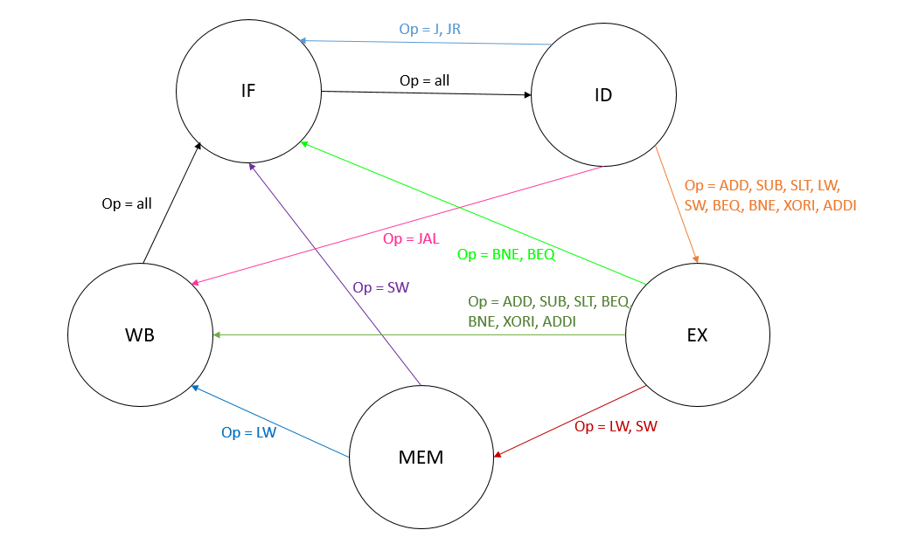
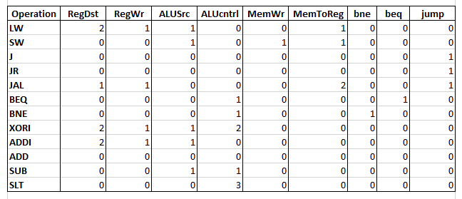
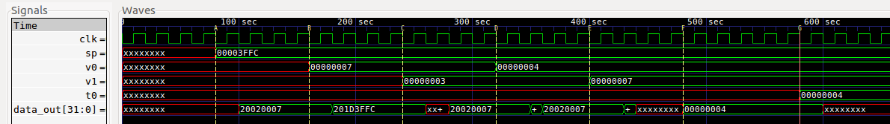
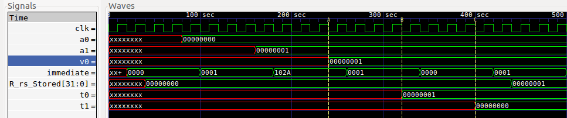
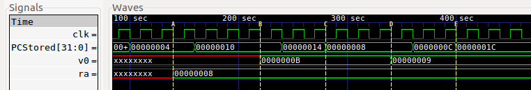
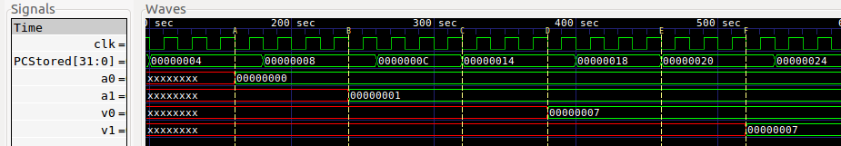

Starting report
=======
# CompArch Lab3: Single Cycle CPU
### Sabrina, Liv, and Jamie

## Processor Architecture

Above is the overview diagram for our multi-cycle CPU. The instruction memory feeds into the decoder, which finds the important information from the instruction by splitting the 32 bit binary number into Rs, Rt, Rd, Imm16, address, opcode, and funct according to the MIPS format. The first four feed into the calculation circuit, while func and opcode inform the control logic. The choose module ensures that the PC is always correct depending on the operation being executed, i.e. jumps, branches, or other operations. The register file and ALU are in the calculation circuitry. The Rs, Rt, Rd fetch operand registers and Imm16 selects immediate values. These values feed into the ALU, and depending on the instruction, can be used to read or store into the CPU registers or memory. The control logic that opcode and funct influence produces control signals that influence the ALU calculations through peripheral circuitry and allow more complex actions to occur.  

The opcode and funct feed into the address generator, which produces jump_addr, branch_addr, and PC4. The address generator modifies the branch and jump information, which allows the choose module to respond to different jump and branch commands. These two modules together effectively function as the program counter, which controls how the CPU iterates through different instructions. The interaction between the elements of this data path allow the CPU to continuously perform calculations after an external reset is set and save them to memory files. 

### Program Counter 
The above diagram is a closer loop at program counter, which consists of the choose circuitry and address generator. The address generator produces a value representing PC4, which is the PC value plus 4. This then feeds into a mux that either passes this value on or resets everything to 0. That output then feeds into another mux that uses an AND gate with Jump and reset as the select line. If jump and reset are true, the mux will pass on the jump address, which is generated by the address generator and determines whether the jump behavior is jumpreg, jump and link, or jump. The output of this jump-related mux is then passed through another mux that relates to different branch commands. The circuitry that feeds into the select line of the branch-related mux includes another mux that chooses between bne and beq, which are flags that are high if BNE or BEQ are the current operation, respectively, and an or gate that includes bne and beq. This feeds into an and gate along with reset to determine whether the branch address should become the PC counter. The output of the branch-related mux will therefore be a branch address, reset, PC+4, or a jump address. This will be stored in a register so that it can be fed into the address generator to determine the next PC.

### FSM

The FSM shown above has five states: Instruction Fetch (IF), Instruction Decode (ID), Execute (EX), Memory (MEM), and Write Back (WB). This module moves the CPU through the appropriate states depending on the current operation. It starts in Instruction Fetch. For every operation, the FSM is in IF for once cycle and always goes to Instruction Decode next. In ID, the control signals in the table below are set according to the current operation. The FSM then goes to either Execute, Memory, Write Back, or Instruction Fetch depending on what is required for the current operation. In EX, the write back and memory flags, `wb` and `mem`, are checked to determine the next state of the current operation. If the operation requires WB or MEM, `wb` or `mem` will be 1, respectively. The MEM state checks the `wb` flag again and sets `MemWr` to high if the current operation is `SW`. `MemWr` is the write enable for the memory. The FSM then switches states to either WB or IF. The WB state goes back to IF. There are four addition control signals. `addrGen` is only high in ID. `PCReg` is only high in IF. It is the write enable for the PC register. The write enables for the `R_rs` and `R_rt` registers, `R_rsReg` and `R_rtReg`, are only high in EX. 

## Testing

## Performance and Design Analysis
In our multi-cycle CPU, the operations take different numbers of cycles. `JR` and `J` each take two cycles. `JAL`, `BNE`, and `BEQ` each take three cycles. `ADD`, `SUB`, `SLT`, `SW`, `XORI`, and `ADDI` each take four cycles. `LW` takes 5 cycles.

