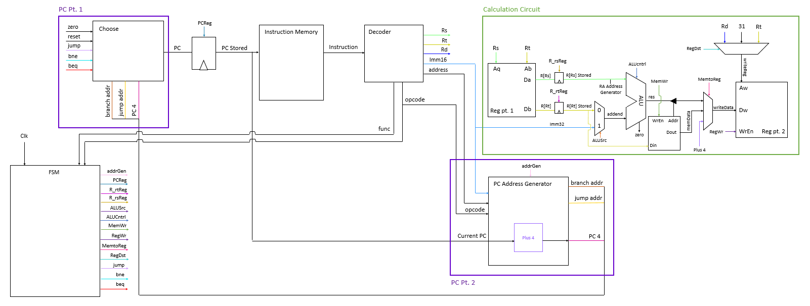
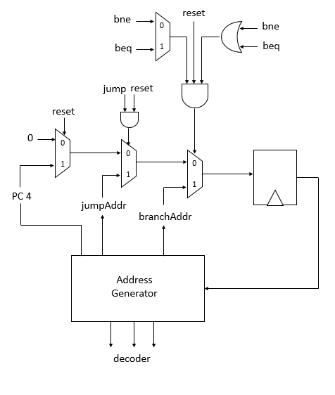

# CompArch Lab4:  Multicycle CPU
### Sabrina, Liv, and Jamie

## Processor Architecture

Above is the overview diagram for our multi-cycle CPU. This is similar to the single cycle CPU, but the control logic is replaced with an FSM that sends all control signals to intermediate register files that save the state of different stages in an effort to reduce run time.

As with last time, the program counter generator will take in the address for branch commands and jump addresses as well as flags for the branch and jump commands to determine what the next value for the PC should be. When the enable signal `PCReg` is set high by the FSM, this PC value is stored in a register.

The instruction memory outputs instructions, for which the PC value is the address. This instruction can then be passed into the decoder, which will break it up into the possible values for `Rs`, `Rt`, `Rd`, `Imm16`, `address`, `opcode`, and `func`. Some of these outputs are wired into the PC address generator so that the address generator can produce the new possible PC addresses, `PC4`, `jumpAddr`, and `branchAddr`. When the address generator is enabled by control signals produced by the FSM, these outputs can be passed back into the PCchoose module. The decoded operands (`Rs`, `Rt`, `Rd`, and `Imm16`) can then be passed into the calculation circuit.

The calculation circuit consists of various subcomponents whose function will depend on the operation to be performed. It includes a regfile, which is split into two parts on the diagram above. When Rs and Rt are passed into the regfile, the outputs are stored into registers (which are enabled by FSM control signals). The R[rs] signal is passed into the ALU. The (Imm16) or R[Rt] can also be passed into the ALU. The ALU can then perform a calculation according to the instruction given. The output can then be stored in a memory file when necessary, and written back to the register file as dictated by the FSM control signals.

### Program Counter

The above diagram is a closer look at the program counter, which consists of the choose circuitry and address generator. The address generator runs during the ID state, which will be explained in the FSM section. The address generator produces a value representing PC4, which is the PC value plus 4. This then feeds into a mux that either passes this value on or resets everything to 0. That output then feeds into another mux that uses an AND gate with Jump and reset as the select line. If jump and reset are true, the mux will pass on the jump address, which is generated by the address generator. The address generator determines whether the jump behavior is `JR`, `JAL`, or `J`. The output of this jump-related mux is then passed through another mux that relates to different branch commands. The circuitry that feeds into the select line of the branch-related mux includes another mux that chooses between `bne` and `beq`, which are flags that are high if `BNE` or `BEQ` are the current operation, respectively, and an OR gate that includes `bne` and `beq`. This feeds into an and gate along with reset to determine whether the branch address should become the PC counter. The output of the branch-related mux will therefore be a branch address, reset, PC+4, or a jump address. This will be stored in a register so that it can be fed into the address generator to determine the next PC.

### FSM

The FSM shown above has five states: Instruction Fetch (IF), Instruction Decode (ID), Execute (EX), Memory (MEM), and Write Back (WB). The state changes at the positive clock edge. This module moves the CPU through the appropriate states depending on the current operation.

The FSM starts in Instruction Fetch. The control signal `PCReg` is only high in IF and is the write enable for the PC register, so the PC updates in this state. For every operation, the FSM is in IF for once cycle and always goes to Instruction Decode next.

In ID, the instruction is decoded by the decoder. Also in ID, the control signals in the table below are set according to the current operation. `addrGen` is only high in ID. This is when a new `PC + 4`, `jumpAddress`, and `branchAddress` are output from the PCaddreGen. The write enables for the `R_rs` and `R_rt` registers, `R_rsReg` and `R_rtReg`, are only high in ID. The FSM then goes to either Execute, Memory, Write Back, or Instruction Fetch depending on what is required for the current operation.

In EX, the calculations involving the ALU circuitry are executed. Then, the write back and memory flags, `wb` and `mem`, are checked to determine the next state of the current operation. If the operation requires WB or MEM, `wb` or `mem` will be 1, respectively.

The MEM state is used to read from or write to the memory for `LW` and `SW`, respectively, so the FSM sets `MemWr`, the memory write enable, to high if the current operation is `SW`. The FSM then checks again to see if `wb` is high, and then switches states to either WB or IF.

The WB state is for writing data back to the register. The FSM then goes back to IF.

## Testing

Below are the waveforms for a series of tests for the functionality of the operations.

### Arithmetic, Store Word and Load Word

Markers A, B and C all indicate correct loading of values into the target registers using `ADDI`. At marker D, `SUB` is used to store `$v0`-`v1` into `$v0`. At marker E, `ADD` is used to store `$v0`+`$v1` into `$v1`. At marker F, we can tell that the value of `v0` (d4) is stored into the memory at the address in `$sp` as we see the correct value in the memory's `data_out`. At marker G, we see that the load word operation has successfully occurred as the the value (d4) stored in the address of `$sp` is correctly loaded into `$t0`.

### Set Less Than, and XORI

Marker A indicates the correct result of the `SLT` operation. `SLT` is used to store `($a0 < $a1)?1:0` in `$v0`. Since `$a0 = 0` and `a1 = 1`, `$v0 = 1` is both the expected and actual result. Markers B and C both indicate the correct result of the `XORI` operation. First, `XORI` is used to store `$a0^1` in `$v0`, then `XORI` is used to store `$a0^0` in `$v1`. Both are correctly calculated, as `$v0 = 1` and `$v1 = 0`.

### Jump, Jump and Link, and Jump Register

The first operation performed is a `JAL` operation, and so at marker A we see that PC+4 (d8) is stored in `$ra` and the PC jumps ahead for the next operation.  At marker B, we see that an `ADDI` operation was performed and d11 was stored in `$v0`, and then at marker C we see that a `JR` operation took us back to the the PC value stored in `$ra` (d8). At marker D, we see that another `ADDI`stores d9 into `$v0`. After this at marker E, the CPU is instructed to use a `J` operation to jump to the end of the program and perform no further operations. In the original assembly code, there is an instruction that requests for d14 to be written into `$v0`, but the jumps make it so that it should never happen - because we never see the value in `$v0` become a d14, we know that the jumps are functioning properly.

### Branch If Equal and Branch Not Equal

Markers A and B show `ADDI` correctly writing `$a0 = $zero + 0` and `$a1 = $zero + 1`, respectively. Marker C shows the `PCStored` changing from 12 to 20 as a result of `BEQ`. The instruction is to branch if `$a0 == $zero`, which is true. Marker D shows `ADDI` correctly writing `$v0 = $zero + 7` which is the instruction at the branch address. At Marker E, the `PC` changes from 24 to 32 as a result of `BNE`. The instruction is to branch if `$a0 != $a1`, which is true. The instruction at the branch address is and `ADDI` operation: `$v1 = $zero + 7`, which we see executing correctly at Marker F. The `PC` then increases by 4, which is correct for an operation that is not a branch or a jump. This test shows that our CPU can execute branches properly.

## Performance and Design Analysis
In our multi-cycle CPU, the operations take different numbers of clock cycles. `JR` and `J` each take two cycles. `JAL`, `BNE`, and `BEQ` each take three cycles. `ADD`, `SUB`, `SLT`, `SW`, `XORI`, and `ADDI` each take four cycles. `LW` takes 5 cycles.
